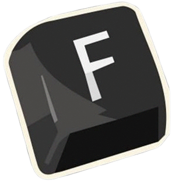

# TecladoSounds

> **EN:** Lightweight mechanical keyboard sound simulator. Pick a switch profile and hear every keystroke.
> **ES:** Simulador ligero de sonidos de teclado mecánico. Elige un perfil y escucha cada tecla mientras escribes.



---

## Features / Características

- **17+ profiles** of real mechanical switches (MX Blue, Brown, Holy Panda, Alpaca, NK Cream, etc.)
- **17+ perfiles** de switches mecánicos reales
- **Real-time switching** — change profiles without stopping the sound
- **Cambio en vivo** — cambia de perfil sin detener el sonido
- **System tray** — minimizes to tray when closed
- **Bandeja del sistema** — se minimiza al cerrar la ventana
- **Dark mode** UI
- **Modo oscuro** integrado
- **Auto-start** with Windows & auto-start sound (optional)
- **Inicio automático** con Windows y del sonido (opcional)
- **Portable** — no dependencies required in compiled version
- **Portátil** — sin dependencias en la versión compilada

---

## Download / Descarga

### Compiled (recommended) / Compilado (recomendado)

Download the latest release from [GitHub Releases](https://github.com/NobinGJ/tecladosound/releases). Just run `TecladoSounds.exe`.

Descarga la última versión desde [GitHub Releases](https://github.com/NobinGJ/tecladosound/releases). Solo ejecuta `TecladoSounds.exe`.

### From source / Desde código fuente

```bash
git clone https://github.com/NobinGJ/tecladosound.git
cd tecladosound
pip install -r requirements.txt
python tecla.pyw
```

### Build your own .exe / Compilar tu propio .exe

```bash
pip install pyinstaller
pyinstaller --onefile --name TecladoSounds --noconsole --icon Logo.png --add-data "Logo.png;." --add-data "keyboardsounds\profiles;keyboardsounds\profiles" tecla.pyw
```

Output: `dist/TecladoSounds.exe`

---

## How to use / Cómo usar

1. Run `TecladoSounds.exe` (or `python tecla.pyw`)
2. Select a profile from the left panel
3. Click **Iniciar / Start**
4. Type anywhere — you'll hear the switch sound
5. Change profiles anytime without stopping
6. Adjust volume with the slider

### System tray / Bandeja del sistema
- Closing the window minimizes to tray
- Right-click the tray icon: **Open / Abrir**, **Settings / Ajustes**, **Close / Cerrar**

---

## Development / Desarrollo

### Requirements / Requisitos
- **Python 3.12+**
- Dependencies: `customtkinter`, `pygame`, `pynput`, `pystray`, `Pillow`, `PyYAML`

### Setup / Instalación del entorno

```bash
python -m venv venv
.\venv\Scripts\activate     # Windows
pip install -r requirements.txt
```

---

## Adding a custom profile / Añadir un perfil personalizado

1. Create a folder in `keyboardsounds/profiles/my-profile/`
2. Add your audio files (`.wav` or `.ogg`)
3. Create a `profile.yaml`:

```yaml
profile:
  name: "My Switch"
  author: "Your Name"
  description: "Sound description"
  device: keyboard

sources:
  - id: default
    source: key.wav

keys:
  default: [default]
```

---

## Project structure / Estructura del proyecto

```
tecladosound/
├── dist/                  # Compiled .exe
├── keyboardsounds/
│   └── profiles/          # Sound profiles
├── docs/                  # GitHub Pages website
├── tecla.pyw              # Main application
├── Logo.png               # App logo
├── config.json            # Auto-generated config
├── requirements.txt
└── README.md
```

---

## License / Licencia

This project includes sound profiles based on [keyboardsounds](https://github.com/keyboardsounds/keyboardsounds) and other sources. Each profile may have its own license.

Este proyecto incluye perfiles de sonido basados en [keyboardsounds](https://github.com/keyboardsounds/keyboardsounds) y otras fuentes. Cada perfil puede tener su propia licencia.
